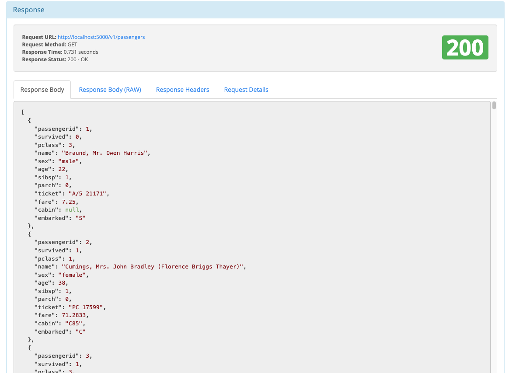
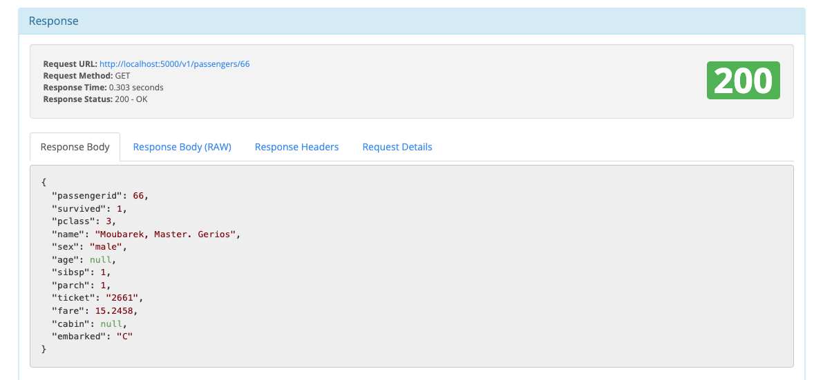
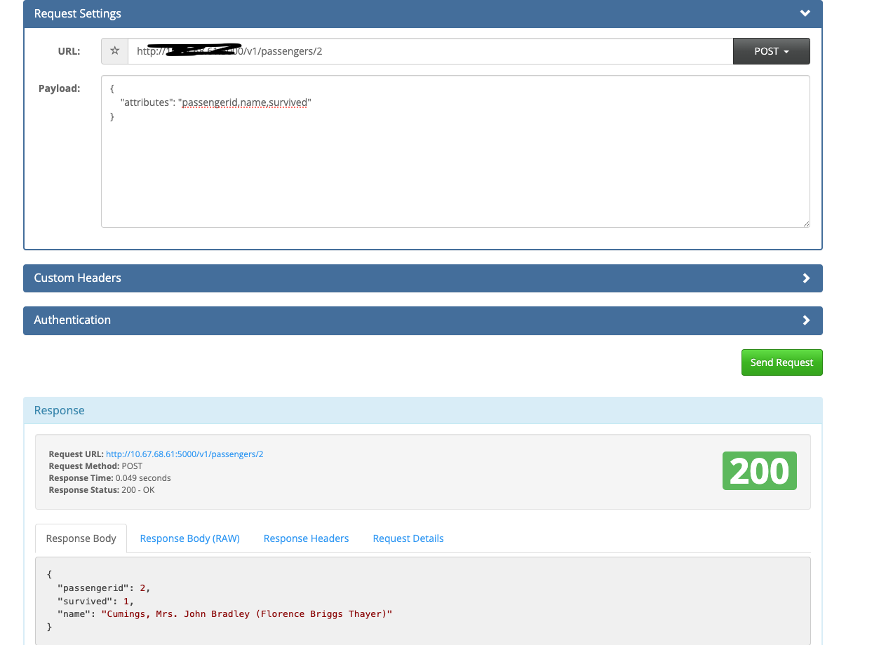
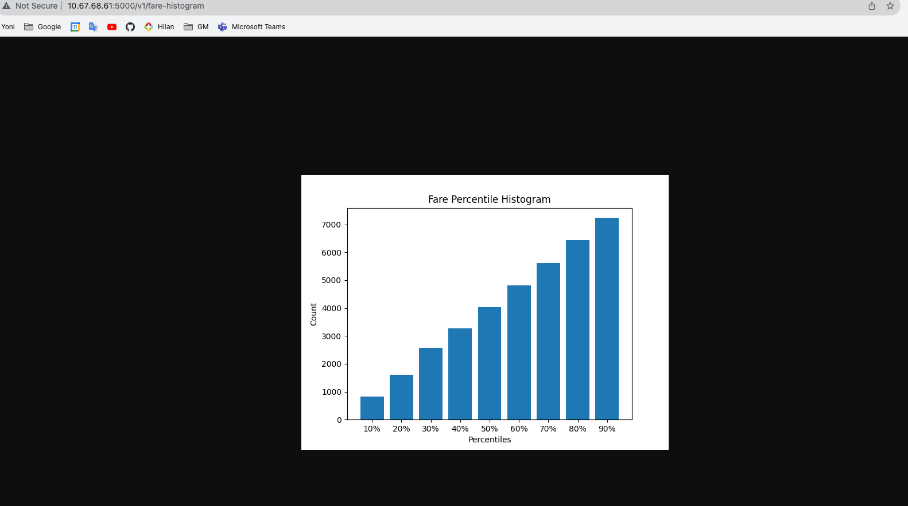
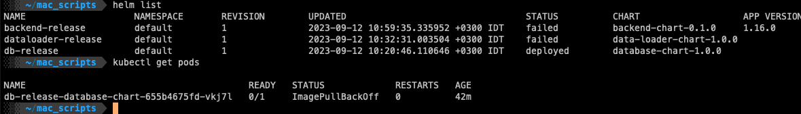

# Titanic Passenger Data Web Service

## Author
Yoni Zadik

## General Description

The Titanic Passenger Data Web Service is a tool designed to facilitate the loading of raw Titanic passenger data into a PostgreSQL database and provide user-specific details upon request. This service allows users to interact with the Titanic dataset, retrieve information, and perform various data operations.

## Basic requirements
1) docker-compose
2) docker deamon
3) Helm
4) Minikube

## User Instructions

To use the Titanic Passenger Data Web Service on a **Linux** system, follow these steps:

1. Clone the project repository to host.

```bash
git clone https://github.com/YoniSW/TitanicData.git
```

2. Set the PROJECT_DIR environment variable to the project directory path.
```bash
cd TitanicData
export PROJECT_DIR=$PWD
```

3. Build the Docker containers for the web service.
```bash
cd docker
docker-compose build
```

4. Start the web services using Docker Compose.
```bash
docker-compose up
```

Titanic Passenger Data Web Service will be running on http://127.0.0.1:5000 (http://localhost:5000)
You can now access and use the Titanic Passenger Data Web Service by making HTTP requests to the appropriate endpoints. Be sure to refer to the documentation for details on available endpoints and how to interact with the service.
## Usage example

```bash
docker-compose build
docker-compose up
```
**Services are up and running.**


**API end-points**
1. **GET /v1/passengers**


2. **GET /v1/passengers/<int:passenger_id>**


3. **POST /v1/passengers/<int:passenger_id>**


4. **GET /v1/fare-histogram**


**Swagger will be avialable under: http://localhost:5000/swagger**
Use it to check and test REST API.


## Testing
1) Unit tests.
2) Bad data is easier detect with flask_restx:


## TODO
1) Helm & Minikube was partly deployed.


2) Add more tests.
